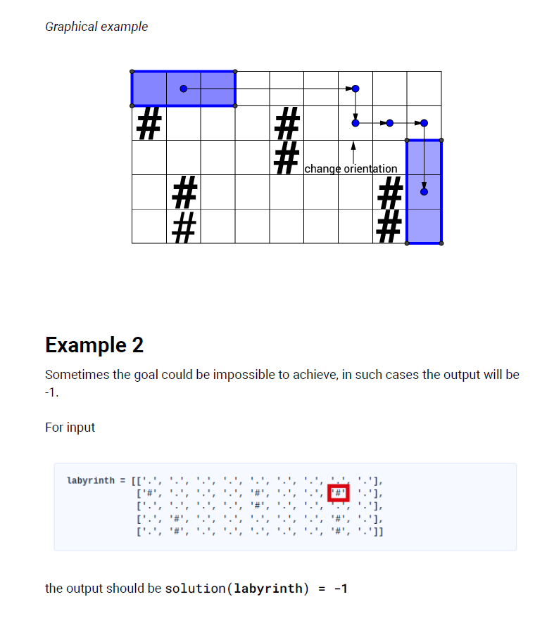
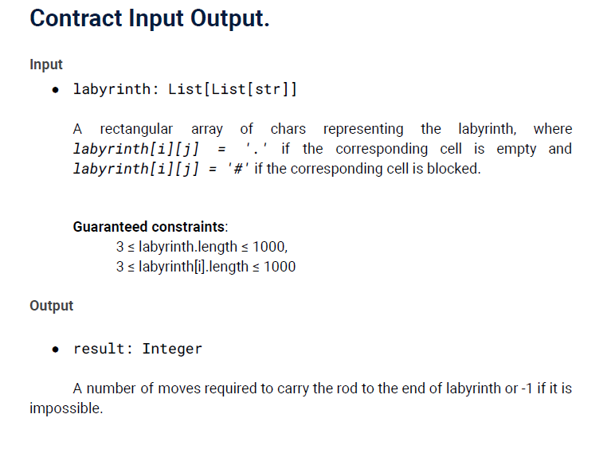
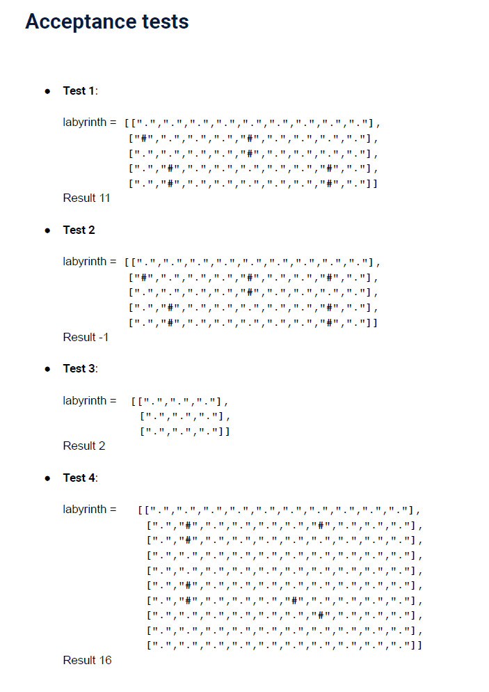

# Proyect_Data_Engineer_Challenge:

Juego de encontrar los movimientos mínimos de una piedra de 1x3 para llegar al extremo inferior derecho de un array de 2 dimensiones.

# COMO EJECUTAR EL ARCHIVO APP.PY:
RUN IN TERMINAL: -> python /workspace/Proyect_Data_Engineer_Challenge/src/app.py
OR: -> python /workspace/Proyect_Data_Engineer_Challenge/src/app.py > output.txt

# Descripcion del reto:

Hello, future Damavis teammate! First of all, thanks for accepting our challenge. You
are free to use any programming language from among Scala, Python or Java.
Here’s the challenge to evaluate how you code, so please do not use ChatGPT or
similar, not even to get ideas about which algorithm to develop. Trust us when we
say that we are capable of discerning between code generated using concepts from
ChatGPT and code produced through independent development. Send us your own
code, thought and written by yourself without any help from anyone. We value the
presence of documentation regarding the utilized code structure, the implemented
algorithm, and instructions on its execution.
Try not to use any framework or external library, use only the base language
capabilities. We value readable code, structure, tests, good code principles and best
practices. You are free to choose the programming code paradigm and architecture
that you think that fits best. Therefore, aim to avoid coding in Jupyter Notebooks or
in a single file without any structure.
If you cannot finish the challenge, please send us your partial solution anyway.
It’s preferably you to create a Version Control System (VCS) repository. Git could be
a good choice to track your commits, and easily share your results with us. Although,
if you are not familiar with VCS, simply send us a zip file containing your code.

# EXPLICACION DEL JUEGO:

The goal is to carry the rod from the top left corner of the labyrinth to the bottom
right corner. This rod is not exactly the lightest thing you can imagine, so the
participant would naturally want to do it as fast as possible.
Find the minimal number of moves required to carry the rod through the labyrinth.
The labyrinth can be represented as a rectangular matrix, some cells of which are
marked as blocked, and the rod can be represented as a 1 × 3 rectangle. The rod
can't collide with the blocked cells or the walls, so it's impossible to move it into a
position in which one of its cells coincides with the blocked cell or the wall. The goal
is thus to move the rod into position in which one of its cells is in the bottom right
cell of the labyrinth.
There are 5 types of moves that the participant can perform: move the rod one cell
down or up, to the right or to the left, or to change its orientation from vertical to
horizontal and vice versa. The rod can only be rotated about its center, and only if the
3 × 3 area surrounding it is clear from the obstacles or the walls.
The rod is initially positioned horizontally, and its left cell lies in [0, 0].

# Ejemplos:

# Condiciones iniciales y finales:

# TESTS de Ejemplos:

